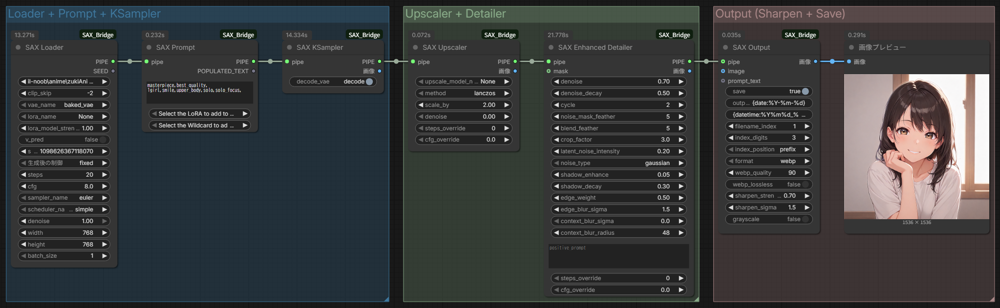
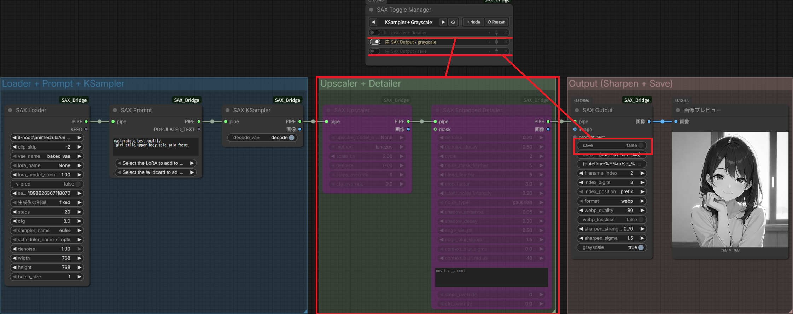
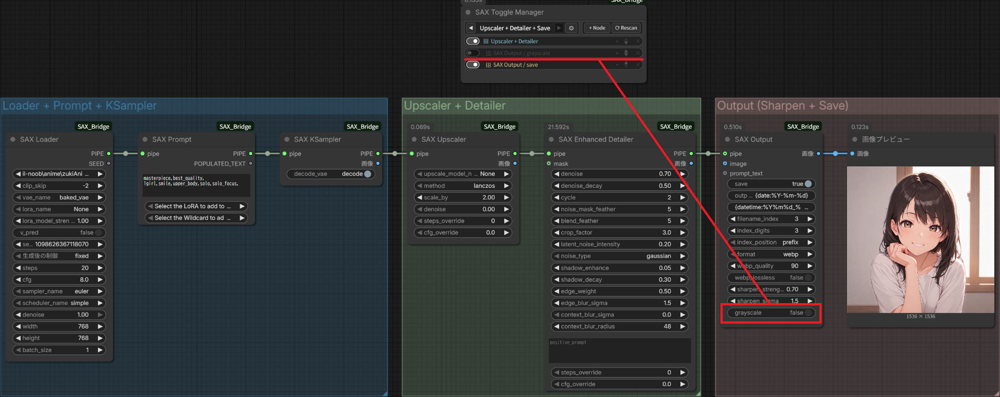
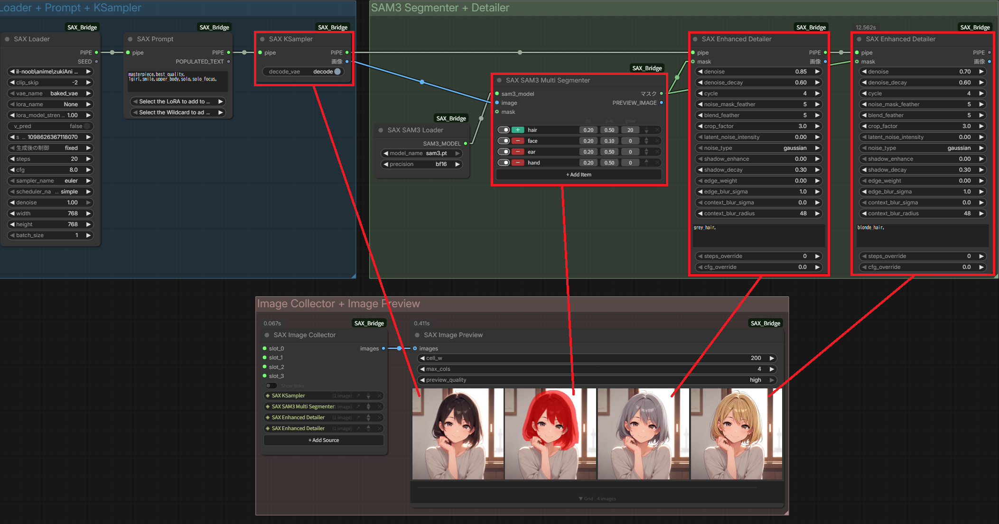

# SAX_Bridge

[JP](README_ja.md) | [Key Features](#key-features) | [Installation](#installation) | [Dependencies](#dependencies) | [Node Reference](docs/nodes_en.md) | [MIT License](#license)

**Build advanced workflows with fewer nodes. Smart trial-and-error with management nodes.**

SAX_Bridge is a collection of custom nodes that fills the missing pieces in ComfyUI workflows.
From loading checkpoints, CLIP, and LoRA to prompt processing, sampling, detailing, and output — all in a minimal set of nodes, enabling high-quality generation without complex configurations.
A unique scene-based control system lets you batch-manage nodes and groups, quickly switch between configurations, and shorten your iteration cycle.

---

## Key Features

<a id="detailer"></a>

### Advanced image quality in one node — Detailer



> **SAX Loader → SAX Prompt → SAX KSampler → SAX Upscaler → SAX Enhanced Detailer → SAX Output**
> Complete pipeline from generation to upscaling, detailing, and saving — in just 5 nodes.
> *(checkpoint: ZUKI anime ILL)*

Crops the mask region, runs i2i redraw, and blends back into the original image — **all in one node**.
Differential Diffusion is built in, so boundary blending requires no separate adjustment.
Simply append it to the end of your workflow to automatically refine areas prone to softness — faces, hands, text, and more.

For even higher quality, choose **SAX Enhanced Detailer** to add Shadow Enhancement, Edge Enhancement, and Latent Noise injection.

Both Detailer nodes include an optional **CFG Guidance Enhancement** feature — select a mode and adjust strength to improve detail rendering.

| Mode | Target | Effect |
|---|---|---|
| `agc` | High CFG (5+) | Suppresses color saturation spikes via tanh soft-clipping |
| `fdg` | High CFG (5+) | Emphasizes detail via frequency band separation |
| `agc+fdg` | High CFG (5+) | Both of the above |
| `post_fdg` | Low CFG (1–3) | Detail emphasis for low-step LoRA workflows (e.g. DMD2) |

> **SAX Guidance** is also available as a standalone node for use before SAX KSampler or SAX Upscaler.
> Guidance also supports **PAG (Perturbed Attention Guidance)** which works independently of CFG scale.

### Finishing touches — Finisher

**SAX Finisher** applies post-processing effects and image quality adjustments to the final image. Place it between the Detailer and Output.

| Effect | Parameter | Description |
|---|---|---|
| Color Correction | `color_correction` | Matches color distribution to a reference image |
| Smooth | `smooth` | Reduces jaggies and oversharpened edges via high-frequency suppression |
| Sharpen | `sharpen_strength` / `sharpen_sigma` | Unsharp Mask edge sharpening |
| Bloom | `bloom` | Soft glow from bright areas for atmospheric lighting |
| Vignette | `vignette` | Darkens edges to draw focus to the center |
| Color Temp | `color_temp` | Warm (+) or cool (−) color temperature shift |
| Grayscale | `grayscale` | ITU-R BT.709 monochrome conversion (applied last) |

All parameters default to 0 / False (disabled). Effects are applied in the order listed above.

[↑ Back to top](#sax_bridge)

---

<a id="toggle-manager"></a>

### Manage your entire workflow by scene — Toggle Manager

| Scene: KSampler + Grayscale | Scene: Upscaler + Detailer + Save |
|:---:|:---:|
|  |  |

> Switch scenes with a single click using **SAX Toggle Manager**.
> Controls group visibility and widget values (grayscale, save) simultaneously.
> Instantly switch from quick preview to full-quality output.

A control node that toggles groups, subgraphs, nodes, and Boolean widgets — **no wiring, no execution required**.
Save multiple scenes and switch the entire workflow configuration instantly with the ◀▶ button.
Pre-register comparison patterns like "with/without LoRA", "with/without upscaling", or "cache on/off" to eliminate manual reconfiguration.

[↑ Back to top](#sax_bridge)

---

<a id="sam3-segmenter"></a>

### Text-guided masking with instant comparison — SAM3 Segmenter × Image Preview



> Broad positive mask for "hair" minus a negative mask for skin — precise hair-only segmentation.
> Pass the mask to two **SAX Enhanced Detailer** nodes for parallel hair color variations.
> Compare all results side by side with **SAX Image Collector + SAX Image Preview**.

**SAX SAM3 Multi Segmenter** generates masks by specifying targets with text prompts.
Combining positive (broad capture) and negative (exclusion) prompts achieves high-precision segmentation without manual masking or selection tools.
The more conditions you stack, the more accurate the result — enabling fine per-part control (hair, face, ears, hands) in a single node.

Pass the generated mask to **SAX Detailer** for refinement, then compare the original, mask, and result side by side in **SAX Image Preview** for fast parameter tuning feedback.

[↑ Back to top](#sax_bridge)

---

<a id="collector"></a>

### Simplify complex wiring — Collector

**SAX Node Collector** aggregates outputs from multiple nodes into one, keeping downstream wiring clean.
Automatically detects and re-syncs when source slots are added, removed, or renamed — connections never break during workflow editing.

**SAX Pipe Collector** acts as a switch that selects the first valid Pipe from multiple routes, enabling conditional branching through wiring alone.
**SAX Image Collector** batch-combines multiple IMAGE outputs and passes them to SAX Image Preview for all-at-once comparison.

[↑ Back to top](#sax_bridge)

---

## Installation

### ComfyUI Manager (Recommended)

Enter the following URL in ComfyUI Manager's "Install via Git URL":

```
https://github.com/so16tm/SAX_Bridge
```

### Manual Installation

```bash
cd ComfyUI/custom_nodes
git clone https://github.com/so16tm/SAX_Bridge
```

[↑ Back to top](#sax_bridge)

---

## Dependencies

| Dependency | Purpose | Required |
|---|---|---|
| ComfyUI | Runtime | ✅ |
| `comfyui-impact-pack` | Wildcard feature (SAX Prompt) | Optional |
| `sam3` | SAX SAM3 nodes | Only when using SAM3 |

> sam3 is not required if you do not use SAX SAM3 nodes.

Install sam3:

```bash
pip install git+https://github.com/facebookresearch/sam3.git
```

#### Windows: triton is required

sam3 depends on [triton](https://github.com/triton-lang/triton), which was historically Linux-only. On Windows, install one of the following **before** installing sam3:

| Environment | Command |
|---|---|
| PyTorch ≥ 2.7 + CUDA ≥ 12.8 | `pip install triton` |
| Older PyTorch / CUDA | `pip install triton-windows` |

`triton-windows` is a drop-in compatible wheel for Windows that bundles TinyCC and a minimal CUDA toolchain, so no additional setup is required. See [triton-lang/triton-windows](https://github.com/triton-lang/triton-windows) for details.

If SAM3 fails to load at runtime, SAX_Bridge will display the underlying `ImportError` (e.g. `No module named 'triton'`) so you can diagnose which dependency is missing.

[↑ Back to top](#sax_bridge)

---

## License

[MIT License](LICENSE) © 2026 so16tm

[↑ Back to top](#sax_bridge)
